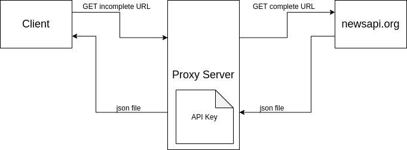

# newsapi-go
This project has the intent to provide a valid interface for newsapi (https://newsapi.org/).

# usage
Finally the project has a stable release! 
You can get it using 
`go get github.com/fulviodenza/newsapi-go`

# run the example
To run the example you don't need to create any api key because i'm offering mine to you!
The only thing actually you have to do is change the config-file.json and run the following commands:
`cd example`
`go run main.go`

# architecture
The project is based on a simple architecture composed by a client and a server running in a container inside an server instance. The server is kept secret because it contains the API Key

# todo list
- [x] write a decent readme and a documentation
- [x] import correctly go module
- [x] write an example source code 
- [x] Include OAuth to generate API Key (proxy server)
- [ ] User interface
